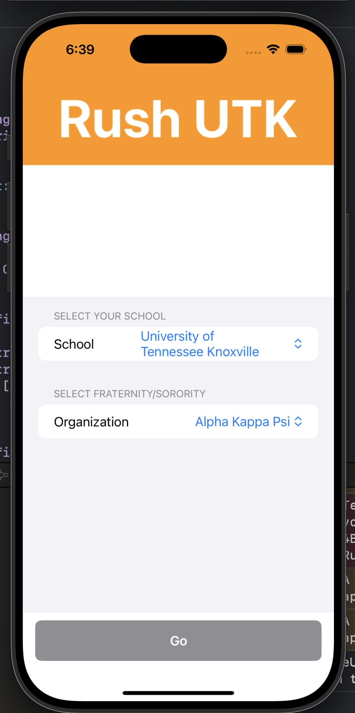

# Rush
(Greek Life Social Media Hub)

**Team Members:** Jeffrey Chen, Aidan Feyerherm, Joseph DiSalvo, Grayson Gill
**Team Name:** Rush
**Overview:** Rush will be a multi-platform-app, similar to many things like GroupMe, Google Calendar, Point Solutions, and more. We plan to combine all of these into one place, a hub for the Greek Organization, to streamline communication and bring it all to one platform. The idea originated from going through the voting process recently and realizing how much of a pain it could be, as well as finding all the events you need to attend on multiple different apps; in general, keeping things more organized.

### Introduction
- We were able to develop the front end of the application and developed the login/sign in page of the application. A big change is that we decided on a different language to use for the app. We have decided to move from Flutter to Swift since we were having complications with Swift.

### Customer Value
- No changes.

### Technology
We have ultimately decided to use swift as the primary language to develop the app. We chose swift because it wasn’t as complex as some other languages like React Native as that is a language built on top of React and JavaScript. Another advantage of using swift is that we can then use Xcode to run the emulator to thus emulate our app so we can see the app being developed and test features, spot discrepancies, etc.

What were the goals for this iteration?
- The goal of this iteration was to at least have something which we do. We have the front page of the app that asks you which school you attend and the organization you belong to.

What test have you run?
- The tests were done on an iPhone emulator so we can see the functionality and the presentation of the app.

What are your goals for the next iteration?
- Our goals for the next iteration is to finally implement many more features and flesh out the app. These features will include a newsletter, announcements, calendar, poll form, messages, and possibly many more.

### Team
What role did the team members have throughout the project?
- We all got together and worked on the project developing through one computer and collaborated. Joseph Disalvo and Grayson Gill were the two leaders who led the discussion and the collaboration. Meanwhile, Aidan and Jeffrey planned and researched things that are needed for the project. Together we all reviewed the code and ideas.

Do you expect team members roles to change going forward?
- No, since we have proven that this works, we think it is unlikely that any further changes will occur between our group dynamics.

### Project Management
Is the product on schedule?
- The project is a little behind schedule. We wished to implement one other feature before the mini demo.

Updates
- The only real update is we changed our architecture from flutter to swift. Besides that, we still completed the UI/front end of the app.
 
### Reflection
What went well?
- For our one time meeting, we worked really well together. We collaborated and discussed every possibility and the solutions to each problem. We made a roadmap and mapped out all the things we could/needed to do.

What didn’t go well?
- Didn’t get to progress/write as much code as we wanted.

What will you do differently for the next iteration?
- We will try to meet up more often so we can get more heavy progress done on the project.

